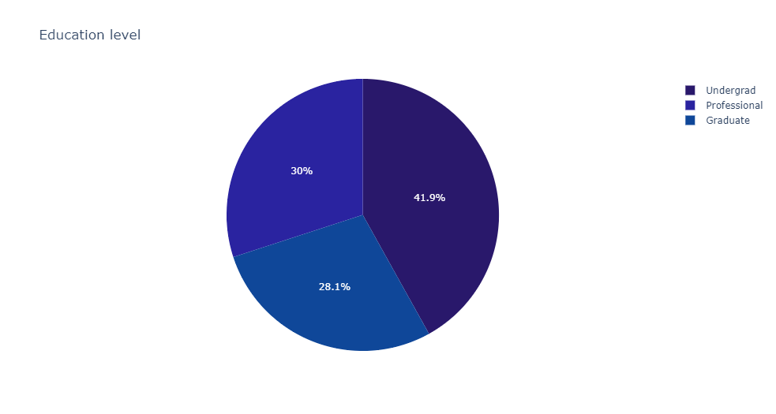

## Bank loans analysis (Python)

## Project Overview
- We need to know which factors influence to give a loan
- We also need to look for any opportunity to increase the bank's assets.
- It was found that apart from income, family size is an important factor.
- The libraries used were pandas, numpy, matplotlib, seaborn and scipy.
- You can access the Jupiter Notebook at this link

## Objectives
Central question:

**What is the most important factor to give a personal loan?**.

Other questions:
* What is the relationship between education and personal loan?
* What is the distribution of the client population?
* What types of accounts and security do our clients have?
* What is the relationship between income and loans?
* What is the relationship between mortgage and loans?

## Data cleaning and preparation
After importing the libraries we prepared the data for analysis.
- Elimination of negative values and useless columns
- Exploration of the correlation of data and outliers: There is a strong correlation between age and experience

- Analysis of the distribution of the data: A large number of outliers were found in income

## EDA
The exploratory data analysis was done with the target questions in mind. Several conclusions were obtained which will be presented below.

- Distribution of client education: The most of clients are undergraduates but it appears that education does not have a direct relationship with personal loan.

- Analysis of client account type: The vast majority of clients do not have a security or credit account. It could generate some extra assets for the bank if we find a way to encourage them to have one.

- Personal loan in relation to other factors: It seems that the most important factor for a loan is income, no surprise there. Another really important factor is the number of relatives in the family.

## Conclusions
- The most influential values are income and family size.
- The least influential values are age and experience. 
- It is advisable to encourage customers to create a credit account and security.
- You can access the code in this link

